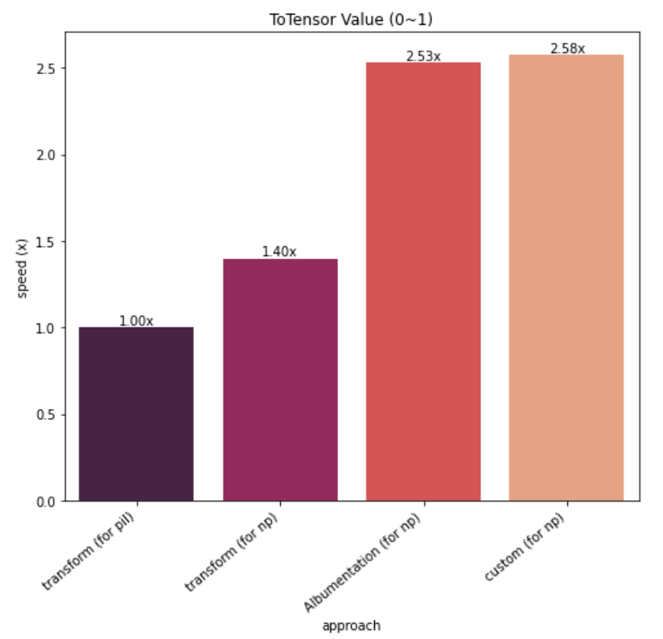
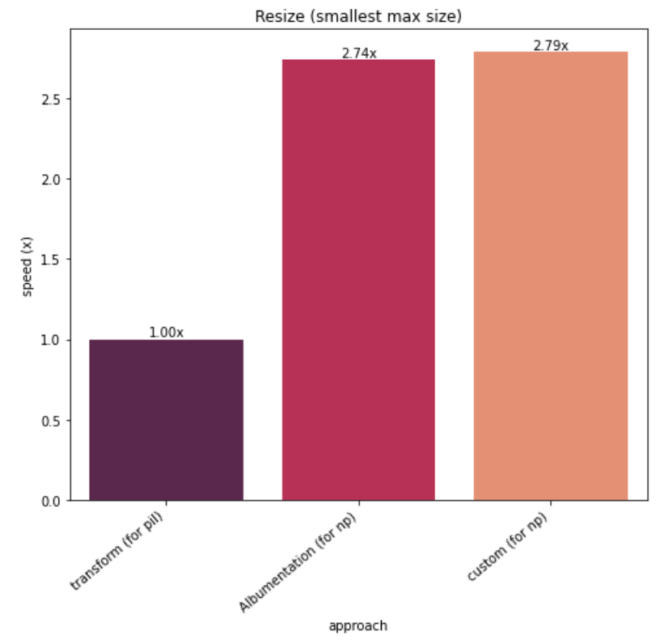
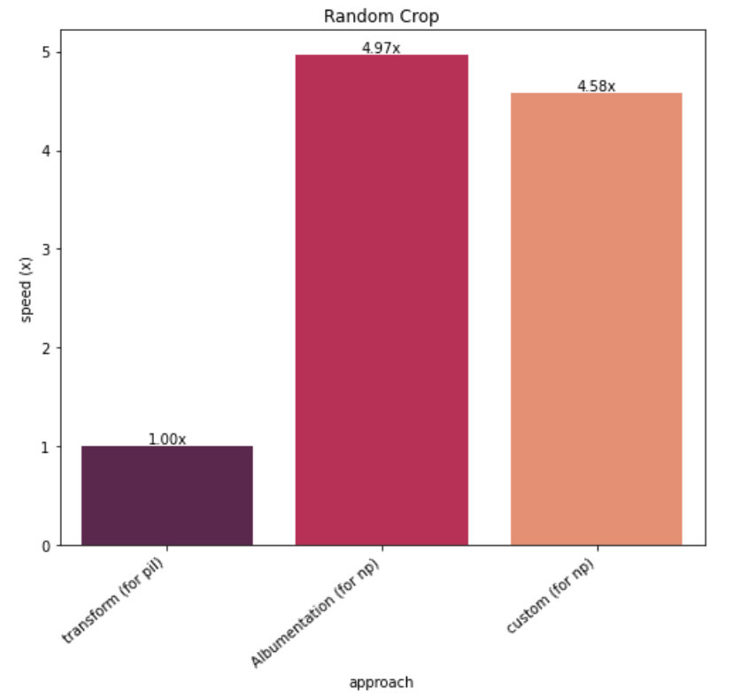
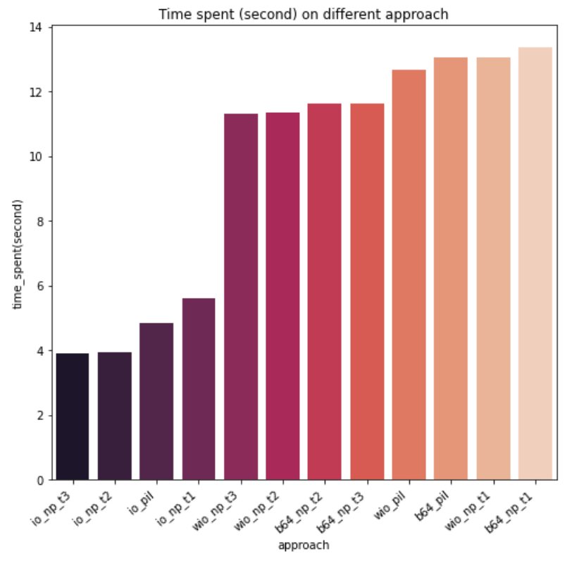

Experimenting on

https://colab.research.google.com/drive/14kwXrgaAsNHrumSzj_VvW8OJMj_w4wIH

# Table of Contents
* [Real-Time Emotional Detector](#rted)
    1. [Target](#ta)
    2. [Experiment](#ex)
    3. [TODO](#todo)
# <a name="rted">Real-Time Emotional Detector
## <a name="ta">Target
#### 1. Be familiar with pytorch pipelines
* Custom Pytorch Dataset   
* Custom Pytorch Transform Class
* Fine-tuning Pytorch Model (Resnet)

#### 2. Deploy using Flask
* Try to use base64 to encode & decode image bytes. 
* Try to use io to wrap image.
* Try to use multi-thread/multi-processing to speed up.
 
## <a name="ex">Experiment
#### 1. Evaluate training transform
* Custom implementation (for np) (fastest)  
* Using Albumentation (for np) (resize the fastest)  
* Using torchvision.transforms (for pil) (slow)
* results:
    
        ToTensor
            - transform (for pil)
                10 loops, best of 5: 2.87 ms per loop
            - transform (for np)
                10 loops, best of 5: 1.9 ms per loop
            - A.ToTensorV2 (for np)
                10 loops, best of 5: 7.67 µs per loop
            - custom (for np)
                10 loops, best of 5: 794 ns per loop

        Resize
            - transform (for pil)
                10 loops, best of 5: 2.8 ms per loop
            - A.Resize (for np)
                10 loops, best of 5: 1.19 ms per loop
            - custom (for np)
                10 loops, best of 5: 1.63 ms per loop

        RandomCrop
            - transform (for pil)
                10 loops, best of 5: 34.3 µs per loop
            - A.randomcrop (for np)
                10 loops, best of 5: 8.74 µs per loop
            - custom (for np)
                10 loops, best of 5: 7.23 µs per loop

    
    
    
#### 2. Evaluate transform function for prediction
* Using numpy to torch (raw) (t3) (fastest)   
* Using numpy + Augmentation (t2) (2nd)   
* Using pil + transforms (3rd)   
* Using numpy to pil + transforms (t1) (slowest)

#### 3. Evaluate image transfer approach through flask
* Opening image through bytes (io) (fastest)   
* Using io.Bytes to wrap (wio) (2th)   
* Encoding with base64 (b64) (slowest)

2+3. Combination results: approach, total time in 100 loops (second)        
         
         [['approach_io_np_t3', 3.908006429672241],
          ['approach_io_np_t2', 3.9259140491485596],
          ['approach_io_pil', 4.82680869102478],
          ['approach_io_np_t1', 5.604491949081421],
          ['approach_wio_np_t3', 11.306720972061157],
          ['approach_wio_np_t2', 11.346932411193848],
          ['approach_b64_np_t2', 11.60984992980957],
          ['approach_b64_np_t3', 11.618371725082397],
          ['approach_wio_pil', 12.65789532661438],
          ['approach_b64_pil', 13.032054662704468],
          ['approach_wio_np_t1', 13.037485122680664],
          ['approach_b64_np_t1', 13.37218427658081]]
    

#### 4. Speed up frame transfer using multi-threading / multi-processing (need more try) on resnet18
* Using raw method (single thread): FPS 5.7
* Using multi-thread: FPS 4.4
* Using multi-process (using process=2): FPS 1.5
    
## <a name="todo">TODO
#### 1. Speed up inference to real-time level
* Model Compression / pruning / quantizaion   
* TensorRT / openvino / tvm
* Better usage of multi-threading / multi-processing

#### 2. Face bounding box detection
#### 3. Velance / Arousal score transformation
